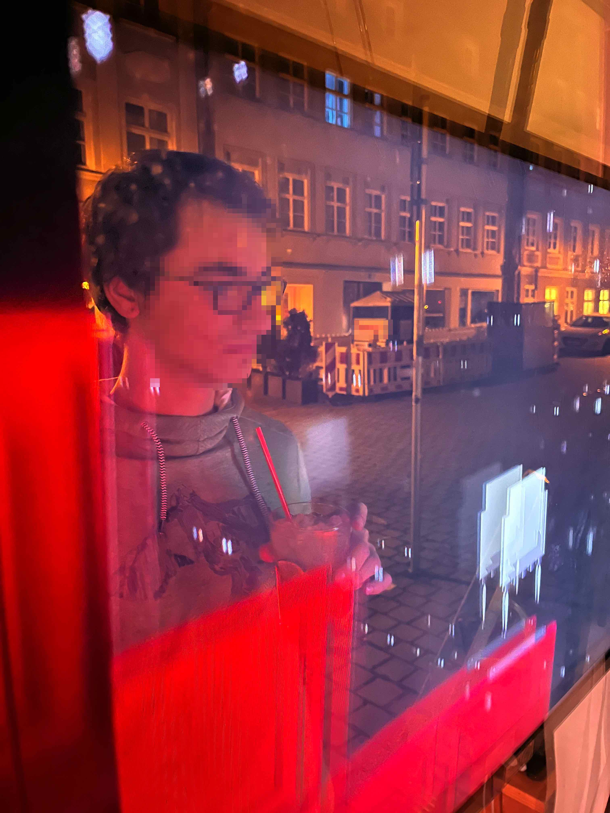
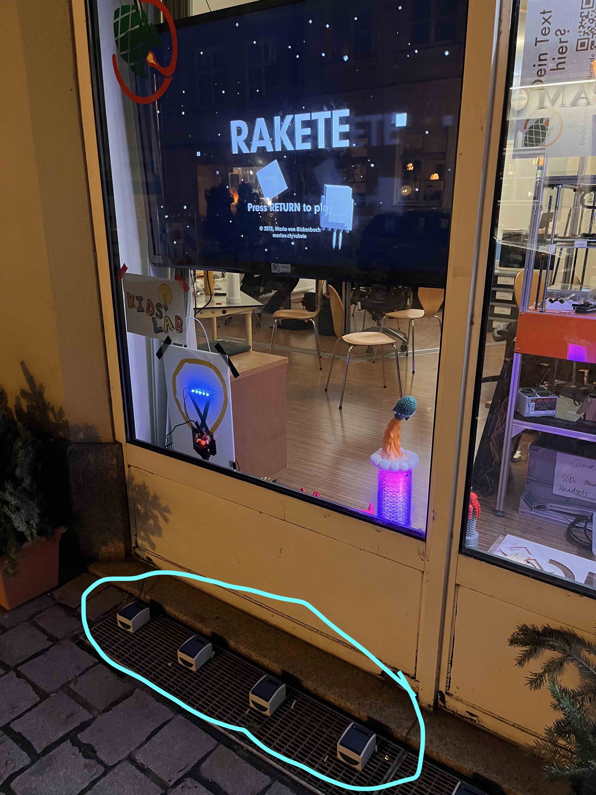
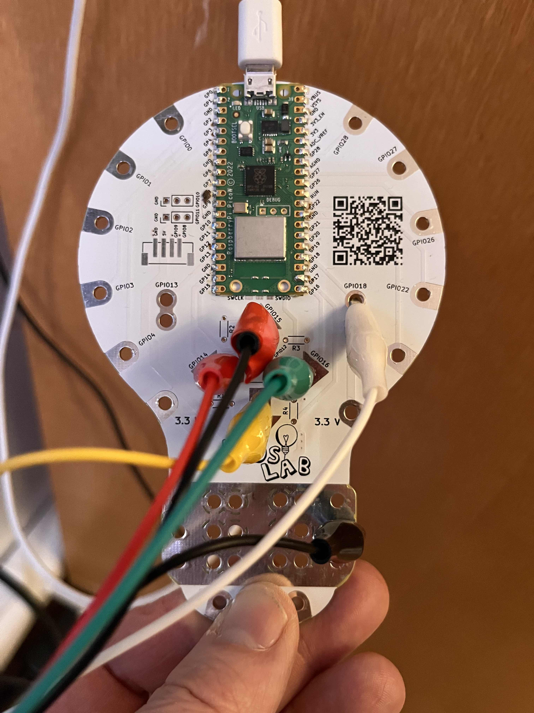

# SchaufensterRakete

Die [Rakete von Mario von Rickenbach](https://mariov.ch/project/rakete) findet einen Platz in unserem Schaufenster!

In diesem Repo sind Code & Anleitungen zum Nachbau und Wartung zu finden.

# Hardware

Wir haben 5 Feuchtraum-Taster (zum Beispiel: [BJ bei Bauhaus](https://www.bauhaus.info/feuchtraum-steckdosen-feuchtraum-schalter/busch-jaeger-ocean-taster/p/12241166)) an dem Lichtschachtgitter von dem Schaufenster montiert.

Über ein Kabel mit 6 Adern werden die Signale nach innen geführt. 

Wir haben die Schalten noch modifiziert, ein Loch an einer Stelle gebort, dass u.u. eintretendes Wasser abfließen kann, normalerweise werden sie ja nicht "liegend" montiert.

Auf der anderen Seite ist ein Raspberry Pico mit einer [PicoKrokoBirne](https://github.com/KidsLabDe/PicoKrokoBirne/) (Breakout für den Pico mit Krokoklemmen-Anschluss), der die Signale annimmt und dann einen Tastatur emuliert (USB-HID): so werden aus den Signalen die Tasten C,V,B,N,M für das Spiel.

# Software

Bei der Software auf dem Pico haben wir auf CircuitPython zurückgegriffen, da es eine gute Unterstützung für eine [Keyboard-Emulation](https://docs.circuitpython.org/projects/hid/en/latest/) bietet.

Der Code nutzt aktuell die Befehle press() und release(): es wird beim Drücken eines Tasters die jeweilige Taste der Tastatur gedrückt und beim Loslassen wieder losgelassen. Bei verwenden von send() war das Ergebnis, dass die Taste ganz oft nacheinander gedrückt wurde - was zu einem schlechten Spielerlebnis führte, da nicht der volle Schub erreicht wurde.

## Timeout

Wenn das Spiel 90 Sekunden nicht gespielt wird, geht es auf den Start-Screen zurück: hier muss 1 mal Enter gedrückt werden, um das schiel zu starten. Da wir nur 5 Taster hatten, haben wir das in der Software so gelöst, dass nach 90 Sekunden nicht benutzen immer erst 2 Enter geschickt werden.

# Infos von Mario

Highscores solltest du aus den PlayerPrefs lesen können:
https://docs.unity3d.com/ScriptReference/PlayerPrefs.html (Company: Playables, AppId: net.playables.rakete)

es gibt für jeden Level einen Eintrag der die Sekunden speichert, zb. "level_0": "10.542" etc. Wenn es keinen Highscore gibt, gibt es keinen Eintrag.

Bin jetzt nicht sicher welche Version ihr habt. Bei der aktuellen (siehe itch.io link unten) gibts eine Möglichkeit, den "exhibition mode" einzustellen, der die Levelauswahl überspringt und automatisch startet wenn es einen Input der 5 Tasten gibt. Inhaltlich (Levels etc.) sind die Versionen gleich.

Für diesen Modus muss man das Spiel mit "-exhibition" in der command line starten, also zb. "rakete.exe -exhibition" auf Windows. Der 90-Sekunden Reset passiert in dieser Version nur mit aktivierten Exhibition Mode (bei der alten war das immer der Fall).
